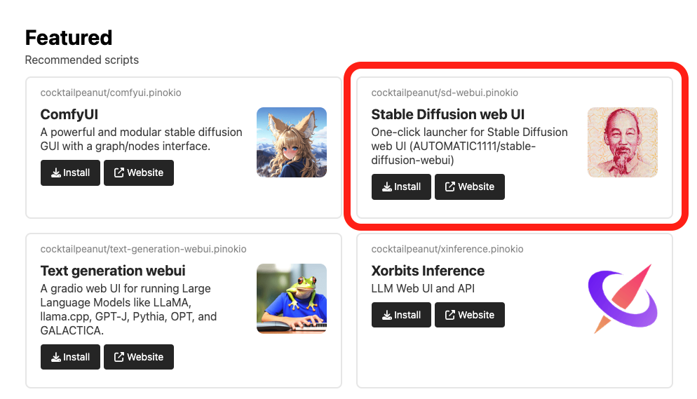
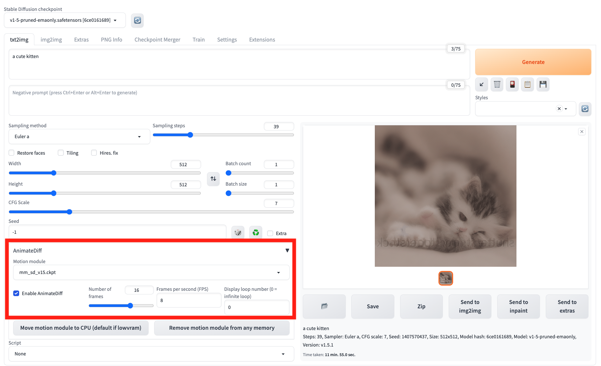

# AnimateDiff One-click Installer

A one-click installer for [AnimateDiff sd-web-ui Extemsion](https://github.com/continue-revolution/sd-webui-animatediff)

# Usage

## Step 1. Install sd-webui.pinokio

From the Discover page, install the stable diffusion web UI script (sd-webui.pinokio) to install the Stable Diffusion Web UI.

## Step 2. Install AnimateDiff Extension

From the dashboard, click "Install" to install this extension.

## Step 3. Enjoy!

Now launch the Stable Diffusion Web UI engine, and enable the AnimateDiff section (check the "Enable AnimateDiff" checkbox). You're now ready to play!

